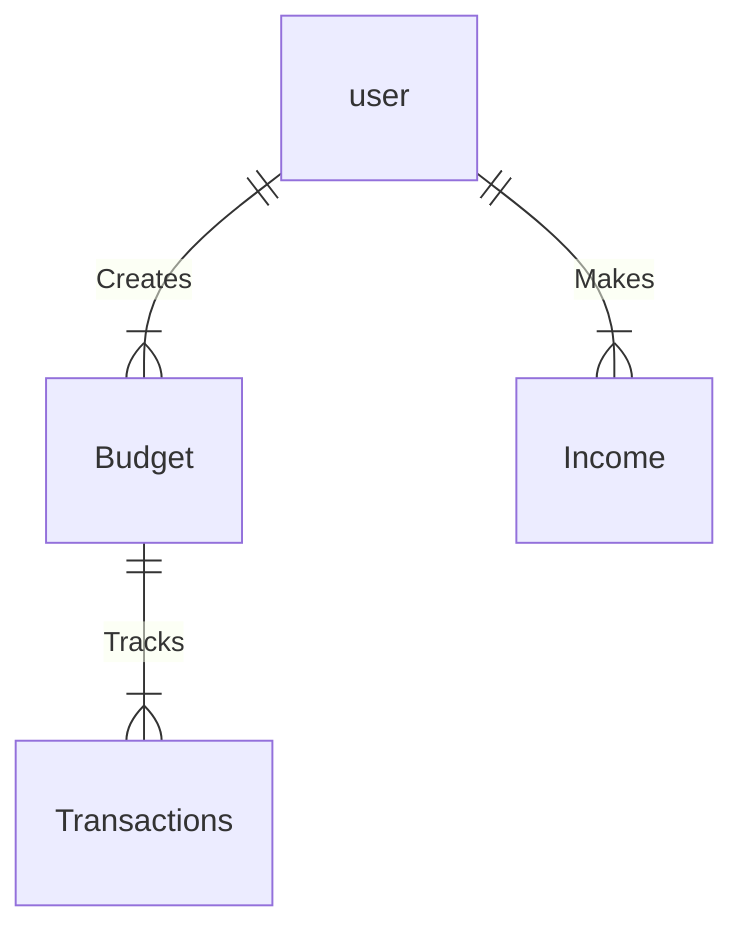

# Mermaid ER Diagram

This contains the diagram for our models and a basic outline on how they relate to one another

```mermaid
erDiagram

    x[user]
    b[Budget]
    i[Income]
    t[Transactions]

    x ||--|{ b : Creates
    b ||--|{ t : Tracks
    x ||--|{ i : Makes

```